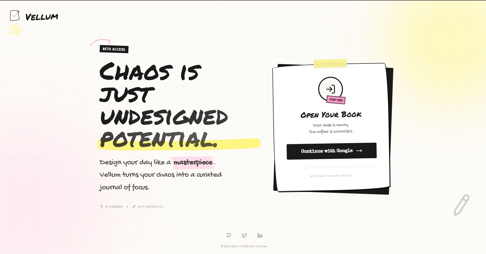

# Vellum

Vellum is an intelligent productivity system designed for students and learners. Unlike traditional task schedulers that only list what you need to do, Vellum helps you manage the entire process of completing a goal.

When you add a task, the application uses AI to analyze its complexity and automatically breaks it down into smaller, actionable steps called chunks. This prevents you from feeling overwhelmed by large objectives. Vellum also features a smart scheduler that helps you organize these tasks into your day while respecting your natural energy peaks and available time.

---



## Features

### AI Task Management

- The application uses AI to analyze how complex a task is.
- It can automatically break down large goals into smaller, actionable steps.
- The app estimates the time needed for tasks based on your experience level.

### Schedule Management

- Users can manage their tasks using a daily or weekly planner.
- It includes a drag-and-drop system for organizing tasks.
- You can set your preferred working hours, such as morning or evening.
- The system helps identify and manage overlapping tasks in your schedule.

### Focus Tools

- A timer helps you track your work sessions.
- The application automatically logs the time you spend on each task.
- You can see your progress through visual bars and markers for finished tasks.

### Insights and Analytics

- The app provides charts that show your peak productivity times and focus distribution.
- It includes tools for reviewing your progress every day or week.

---

## Project Structure

```
vellum/
├── backend/                # API and server logic
│   ├── src/
│   │   ├── ai/             # AI processing
│   │   ├── auth/           # Authentication
│   │   ├── scheduler/      # Scheduling logic
│   │   ├── supabase/       # Database connection
│   │   ├── tasks/          # Task management
│   │   ├── app.module.ts   # Root module
│   │   └── main.ts         # Entry point
│   └── test/               # Tests
│
├── frontend/               # Client application
│   ├── src/
│   │   ├── components/
│   │   │   ├── common/     # Reusable components
│   │   │   ├── layout/     # Page layouts
│   │   │   └── tasks/      # Task-related components
│   │   ├── context/        # Application state
│   │   ├── hooks/          # Shared logic
│   │   ├── pages/          # Authentication pages
│   │   ├── services/       # API clients
│   │   ├── views/          # Main application views
│   │   └── types/          # TypeScript definitions
│   └── index.css           # Global styles
```

---

## Technical Information

### Frontend

- Framework: React 19 and Vite
- Styling: Tailwind CSS
- Animation: Framer Motion
- Icons: Lucide React
- Charts: Recharts
- Database and Authentication: Supabase

### Backend

- Framework: NestJS
- Language: TypeScript
- Database: Supabase (PostgreSQL)
- AI: OpenAI + Llama 3

---

## Getting Started

### Requirements

- Node.js (version 18 or higher)
- npm or pnpm
- A Supabase account and project
- A OpenAI API key

### 1. Clone the Repository

```bash
git clone https://github.com/yourusername/vellum.git
cd vellum
```

### 2. Backend Setup

Go to the backend folder and install the dependencies:

```bash
cd backend
npm install
```

Create a `.env` file in the `backend` folder with these settings:

```env
PORT=3000
CORS_ORIGIN=http://localhost:5173
SUPABASE_URL=your_supabase_url
SUPABASE_ANON_KEY=your_supabase_anon_key
OPENAI_API_KEY=your_groq_api_key
```

Start the backend server:

```bash
npm run start:dev
```

### 3. Frontend Setup

Open a new terminal, go to the frontend folder, and install the dependencies:

```bash
cd frontend
npm install
```

Create a `.env` file in the `frontend` folder with these settings:

```env
VITE_SUPABASE_URL=your_supabase_url
VITE_SUPABASE_ANON_KEY=your_supabase_anon_key
VITE_API_URL=http://localhost:3000
```

Start the frontend server:

```bash
npm run dev
```

The application will be available at `http://localhost:5173`.

---

Author: Eman Nisar ([@emanalytic](https://github.com/emanalytic))
